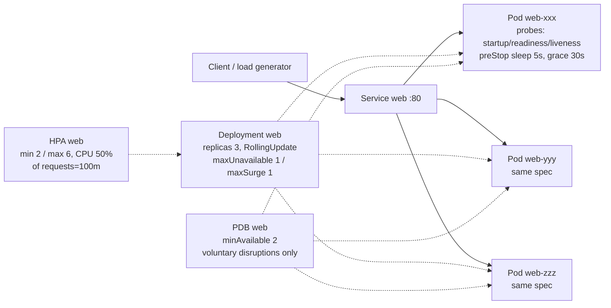

# Kubernetes Reliability Lab

What actually happens when things fail? A small FastAPI app on local Kubernetes
(**kind**), broken on purpose — Pod kills, probe failures, slow starts, rolling
restarts, drains, CPU load — with evidence (`events`, `EndpointSlice`, `restartCount`,
logs) showing what each mechanism does and does **not** guarantee.

> Scope honesty: this is a personal lab validated on local kind. It is not
> production Kubernetes operation. See [Honest scope](#honest-scope).

## Why this project exists

A separate portfolio in this workspace already covers AWS infrastructure
(Terraform, ECS Fargate, RDS, networking, IAM, GitHub Actions, SLI/SLO,
incident investigation, real AWS deployment). Repeating that here would add no
signal. This lab isolates **Kubernetes-specific workload reliability behavior**:
what the controllers, kubelet, probes, PDB, and HPA actually do under failure
and deployment conditions — as reproducible experiments with evidence.

## What this project demonstrates

- Controller self-healing: a deleted Pod is replaced, traffic gated by readiness
- `Running != Ready`: readiness failure removes endpoints without restarts
- Liveness failure restarts the container (process recovery, not traffic gating)
- Startup probe protection for slow-starting containers
- Graceful shutdown during rolling updates, bounded by `terminationGracePeriodSeconds`
- PDB limits *voluntary* disruption only — crashes bypass it
- HPA CPU math is relative to `requests.cpu`, with real scale-up/down delays
- CPU throttling vs OOMKilled: compressible vs incompressible resources

## Architecture



- 3 replicas: one failure still leaves 2 serving; rollout/PDB math stays readable.
- Probes hit `/health` (liveness/startup) and `/ready` (readiness) on `:8000`.
- Uvicorn `--timeout-graceful-shutdown 25` < `terminationGracePeriodSeconds: 30`.

## Reliability questions

- What actually happens when a Pod dies?
- Does a readiness failure restart a container?
- How does liveness evidence differ from readiness evidence?
- What protects a slow-starting container from premature kills?
- Can a rolling update drop in-flight requests?
- Does a PDB guarantee availability?
- How does HPA calculate CPU utilization, and why do `requests` matter?
- What is the difference between CPU throttling and OOMKilled?

## Experiments

| Experiment | Question | Status |
|---|---|---|
| [01 Pod failure](experiments/01-pod-failure.md) | What restores capacity when a Pod dies? | PASS |
| [02 Readiness failure](experiments/02-readiness-failure.md) | Does readiness failure restart the container? | PASS |
| [03 Liveness failure](experiments/03-liveness-failure.md) | How does liveness evidence differ? | PASS |
| [04 Startup probe](experiments/04-startup-probe.md) | What protects slow starts? | PASS |
| [05 Graceful shutdown](experiments/05-graceful-shutdown.md) | Do in-flight requests survive rollout? | PASS |
| [06 PDB](experiments/06-pdb.md) | What does a PDB actually protect? | PASS |
| [07 HPA](experiments/07-hpa.md) | How do requests affect HPA math? | PASS |
| [08 Resources](experiments/08-resources.md) | Throttling vs OOMKilled? | PARTIAL |

Validated 2026-09-18 on kind v0.33.0 / Kubernetes v1.37.0 (Docker Desktop,
Windows). Experiment 08 is PARTIAL: CPU phase validated, OOM probe deliberately
not run.

Status definitions: **NOT RUN** (never executed here), **PASS** (observed behavior
matched hypothesis with quoted evidence), **PARTIAL** (core claim held, some step
unconfirmed), **FAIL** (hypothesis contradicted — documented, not hidden).

Each experiment doc separates **Hypothesis / Expected** (theory) from
**Observed behavior** (only filled after a real run; otherwise **NOT YET VALIDATED**).
No result is written before it is seen.

## Key findings

Measured on kind v0.33.0 / Kubernetes v1.37.0 (2026-09-18). Each claim links to
the experiment holding the raw evidence.

- Deleted Pods are not resurrected — the ReplicaSet creates a *new* Pod, and
  service continuity comes from surviving Ready endpoints ([01](experiments/01-pod-failure.md)).
- Readiness-500 gave `Running` + `Ready=False` + endpoint `ready=false` with
  restartCount unchanged; the identical 500 from liveness gave kill + restart +
  `lastState.terminated` ([02](experiments/02-readiness-failure.md),
  [03](experiments/03-liveness-failure.md)). **Running != Ready**, measured.
- A startupProbe is arithmetic, not magic: without one, a 30s slow start
  survived (liveness budget ~45s) but a 45s start restart-looped; with one, the
  30s start rolled out cleanly with 0 restarts ([04](experiments/04-startup-probe.md)).
- A 20s in-flight request survived a mid-flight `rollout restart` (HTTP 200 in
  20.02s); server logs show SIGTERM arriving mid-request and the handler
  finishing before exit — inside the 30s grace budget, with replacements Ready
  ([05](experiments/05-graceful-shutdown.md)).
- PDB `minAvailable: 2` let the first `drain` evict 1 Pod, stalled the second
  drain (`allowedDisruptions=0`), and did nothing against `kubectl delete pod`
  ([06](experiments/06-pdb.md)).
- HPA scaled 3->6 at 75%/50% and back 6->5->3 after load; one Pod pinned at
  453m of a 100m request dominated the average — same load against a 400m
  request would have read ~20% and scaled nothing ([07](experiments/07-hpa.md)).
- A Pod held at 499m against its 500m CPU limit was throttled, never killed
  (restartCount 0->0); memory stayed flat ([08](experiments/08-resources.md),
  CPU phase only).

## Kubernetes guarantees and non-guarantees

| Mechanism | Guarantees | Does NOT guarantee |
|---|---|---|
| ReplicaSet controller | Reconciles replica count; creates replacement Pods | Survival of in-flight requests; session/data preservation |
| readinessProbe | Unready Pods leave Service endpoints (traffic gating) | Restarts, fixes, or drain of in-flight requests |
| livenessProbe | Wedged containers are eventually restarted | Correct diagnosis; safety against aggressive thresholds |
| startupProbe | Bounded init window safe from liveness kills | Startup finishing in time; readiness afterwards |
| RollingUpdate (`maxUnavailable 1`) | At most 1 Pod down at a time during rollout | Zero downtime (long requests, slow readiness still bite) |
| preStop + grace period | Bounded drain window (30s here) | Infinite patience; ordered endpoint propagation by itself |
| PDB (`minAvailable 2`) | Floor on simultaneous *voluntary* disruptions | Any protection against crashes / Node loss |
| HPA (CPU 50% of requests) | Reactive capacity tracking of measured CPU | Instant scaling; correct decisions with wrong requests |

## ECS vs Kubernetes

A sibling portfolio runs the same class of workload on ECS Fargate. Trade-offs, not ranking:

Choose ECS when it fits:

- Deep AWS integration (ALB, IAM roles for tasks, CloudWatch) with less to operate
- Lower orchestration complexity and smaller operational surface for small teams
- Fargate removes Node management entirely

Choose Kubernetes when it fits:

- Richer workload primitives (probes, PDBs, HPAs, rollout strategies as declarative API)
- Portability across clouds/on-prem and a large ecosystem
- Platform abstraction for many teams/services (with real platform-engineering cost)

Which is right depends on workload, team, and organization requirements — not on
this lab. This lab exists to understand the Kubernetes side of that decision.

## Why kind instead of EKS

AWS infrastructure deployment is already validated with real AWS in the sibling
portfolio. This lab's subject is not cluster infrastructure but
Kubernetes workload reliability behavior, so local kind keeps scope and cost
small while keeping experiments reproducible (scripts + manifests + CI).

Running this on EKS production would additionally require: control-plane/Node
architecture, IAM (IRSA), networking/CNI, ingress/load balancing, cluster/node
autoscaling, observability, upgrades, security hardening, multi-AZ, and cost
management. None of that is claimed here.

## Production considerations

This lab is explicitly **not production-ready**. Missing for production:
TLS/ingress with real certs, image registry with signed/tagged releases,
resource right-sizing from measured data, Pod anti-affinity/topology spread,
NetworkPolicies, PodSecurity, secrets management, persistent observability
(metrics/logs/traces, SLOs, alerts), autoscaling of Nodes, upgrade runbooks,
backup/DR, and multi-AZ design. Experiment docs list per-topic implications.

## Repository structure

```text
app/                  # FastAPI app (main.py) + unit tests (test_main.py)
Dockerfile            # uvicorn --timeout-graceful-shutdown 25, exec-form CMD (PID 1 gets SIGTERM)
k8s/                  # namespace, configmap, deployment, service, pdb, hpa, kind-config
scripts/              # create-cluster / build-image / load-image / deploy / destroy-cluster
                      # run-smoke-test / cpu-load  (readable; experiments stay in docs)
experiments/          # 01-08 failure/reliability experiments (hypothesis + evidence format)
.github/workflows/   # CI: pytest, docker build, manifest validation, kind + smoke test
```

## How to run

```bash
# 1. cluster (installs metrics-server for HPA)
bash scripts/create-cluster.sh
# 2. app image
bash scripts/build-image.sh
bash scripts/load-image.sh
# 3. deploy
bash scripts/deploy.sh
# 4. verify
bash scripts/run-smoke-test.sh
# 5. run any experiment in experiments/ (each doc lists exact commands)
# 6. tear down (no cloud resources exist)
bash scripts/destroy-cluster.sh
```

Requirements: Docker, kubectl, kind. CI (`.github/workflows/reliability-lab-ci.yml`)
runs steps 1–4 on every push plus `pytest` and manifest validation
(kubeconform + `kubectl apply --dry-run=client`).

## Honest scope

This repository is a personal reliability lab. It demonstrates locally validated
Kubernetes workload behavior. It does not represent production Kubernetes
operation at an employer. Unvalidated experiments say **NOT YET VALIDATED** /
**NOT RUN** — never PASS.
